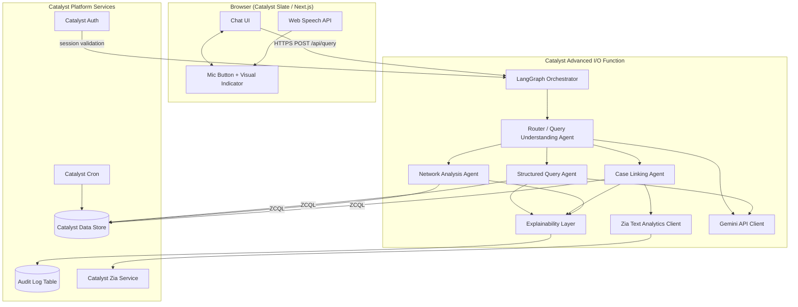
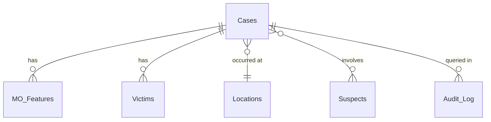

# Design Document: KSP Crime AI

## Overview

KSP Crime AI is an intelligent conversational platform for Karnataka State Police investigators. It provides a natural-language interface over a structured crime database, surfacing case data, MO-based pattern matches, and relational network links — all with full reasoning transparency and DPDP Act-compliant audit logging.

The system runs entirely on Zoho Catalyst. A Next.js frontend (Catalyst Slate) communicates with a LangGraph-orchestrated multi-agent backend running inside Catalyst Advanced I/O Functions. All LLM calls go to Gemini from within the Function; the browser never touches the Gemini API directly. Crime data lives in Catalyst Data Store (ZCQL-queryable). Catalyst Authentication gates access. Catalyst Zia Text Analytics enriches free-text narratives. Catalyst Cron handles nightly batch jobs.

### Key Design Decisions

| Decision | Choice | Rationale |
|---|---|---|
| Orchestration | LangGraph inside Catalyst Advanced I/O Function | Supports multi-step chains within Catalyst's execution model; LangGraph's directed graph is a natural fit for conditional agent routing |
| LLM | Gemini API (server-side only) | Datathon constraint; keeps API keys off the client |
| Similarity algorithm | Jaccard on MO feature sets | Simple, interpretable, no model training needed; investigator can see exactly which features matched |
| Similarity threshold | 0.6 (configurable env var) | Empirically reasonable for 5-feature MO sets; configurable so analysts can tune |
| Data storage | Catalyst Data Store + ZCQL | Mandatory platform; relational schema maps naturally to crime entities |
| Text enrichment | Catalyst Zia Text Analytics | Platform-native NLP; avoids extra Gemini calls for entity extraction |
| Auth | Catalyst Authentication | Mandatory platform; provides session identity for audit trail |

---

## Architecture



### Request Flow

1. Investigator types or speaks a query in the Next.js chat UI.
2. Web Speech API (if used) converts audio to text and populates the input field.
3. The client POSTs the query text plus Catalyst Auth session token to the Catalyst Advanced I/O Function endpoint.
4. The LangGraph Orchestrator validates the session, then starts the directed agent graph.
5. The Router agent calls Gemini to parse intent and extract entities; Zia may enrich named entity spans.
6. LangGraph routes to one or more downstream agents (SQA, CLA, NAA) based on intent flags.
7. Each agent appends to the shared `Reasoning_Trace` context object.
8. The Explainability Layer assembles the final response, writes the audit log record to Catalyst Data Store, and returns the structured JSON payload to the client.
9. The UI renders the answer and the collapsible "Why this answer?" panel.

---

## Components and Interfaces

### 1. Next.js Chat UI (Catalyst Slate)

Responsibilities: render conversation history, voice input, collapsible reasoning panel, auth redirect.

Key client routes:
- `GET /` — chat interface (requires active Catalyst Auth session)
- `POST /api/query` — proxied to Catalyst Function (Next.js API route, adds session cookie)

State managed client-side:
```typescript
interface ConversationMessage {
  id: string;
  role: "user" | "assistant";
  text: string;
  reasoning_trace?: ReasoningTrace;  // rendered as collapsible panel
  timestamp: Date;
}
```

### 2. LangGraph Orchestrator (Catalyst Advanced I/O Function)

Entry point for all backend logic. Owns the LangGraph `StateGraph`.

Graph state:
```typescript
interface AgentState {
  query_text: string;
  session: CatalystSession;
  parsed_intent: ParsedIntent | null;
  entities: ExtractedEntities | null;
  structured_results: QueryResult[] | null;
  linked_cases: LinkedCase[] | null;
  network_results: NetworkResult | null;
  reasoning_trace: ReasoningTrace;
  error: AgentError | null;
  needs_clarification: boolean;
  clarification_question: string | null;
}
```

Graph nodes: `router_node`, `structured_query_node`, `case_linking_node`, `network_analysis_node`, `explainability_node`, `clarification_node`, `error_node`

Conditional edges from `router_node`:
- `intent.type === "case_lookup"` → `structured_query_node`
- `intent.type === "pattern_search"` → `case_linking_node`
- `intent.type === "network_query"` → `network_analysis_node`
- `intent.type === "combined"` → fan out to multiple nodes
- `intent.needs_clarification === true` → `clarification_node`
- `intent.type === "unknown"` → `error_node` (graceful unknown-intent response)

### 3. Router / Query Understanding Agent

Calls Gemini with a structured prompt to parse the query. Optionally calls Zia for named entity spans on longer inputs.

```typescript
interface ParsedIntent {
  type: "case_lookup" | "pattern_search" | "network_query" | "combined" | "unknown";
  needs_clarification: boolean;
  clarification_question?: string;
}

interface ExtractedEntities {
  locations: string[];
  date_range?: { from: string; to: string };
  crime_types: string[];
  suspect_names: string[];
  case_ids: string[];
  mo_features: Partial<MOFeatures>;
  zia_entities?: ZiaEntity[];  // from Zia enrichment
}
```

Gemini prompt strategy: few-shot examples covering English and Kannada queries; structured output (JSON mode).

### 4. Structured Query Agent

Translates `ParsedIntent + ExtractedEntities` → ZCQL → executes against Catalyst Data Store.

```typescript
interface QueryResult {
  table: string;
  rows: Record<string, unknown>[];
  filters_applied: string[];  // human-readable, NOT raw ZCQL
  row_count: number;
}
```

ZCQL generation: template-based with parameterised substitution — no string-interpolated user input to prevent injection. Each template maps to an intent type.

### 5. Case Linking Agent

```typescript
interface MOFeatures {
  entry_method: string;
  time_of_day: "morning" | "afternoon" | "evening" | "night";
  weapon_type: string;
  victim_age_group: "child" | "youth" | "adult" | "elderly";
  target_type: string;
}

interface LinkedCase {
  case_id: string;
  jaccard_score: number;          // intersection / union of MO feature values
  matching_features: string[];    // which MO features matched
  zia_entity_overlap: string[];   // shared Zia-extracted entities
}
```

Jaccard computation:
```
score = |features_A ∩ features_B| / |features_A ∪ features_B|
```
- Feature set = set of `"field:value"` strings from `MOFeatures` + Zia entity strings
- Threshold default: `0.6` (read from `JACCARD_THRESHOLD` env var)
- Query: fetch all cases' MO_Features rows from Data Store, compute scores in-Function

### 6. Network Analysis Agent

Executes multi-hop ZCQL joins across `Suspects`, `Cases`, `Locations` tables. Returns adjacency data with hop counts. Paginates at 100 entities.

```typescript
interface NetworkResult {
  entities: NetworkEntity[];
  edges: NetworkEdge[];
  paginated: boolean;
  total_count: number;
}

interface NetworkEntity {
  id: string;
  type: "suspect" | "case" | "location";
  label: string;
  hop_distance: number;  // 0 = seed, 1 = direct, 2 = one-hop, etc.
}

interface NetworkEdge {
  from_id: string;
  to_id: string;
  relationship: string;
}
```

### 7. Explainability Layer

Assembles `ReasoningTrace` and writes the audit log record.

```typescript
interface ReasoningTrace {
  query_parsed: ParsedIntent & ExtractedEntities;
  agents_invoked: string[];
  zcql_filters: string[];         // human-readable filters, not raw ZCQL
  jaccard_scores: Array<{ case_id: string; score: number; matching_features: string[] }>;
  zia_entities: ZiaEntity[];
  traversal_path?: NetworkEdge[];
  failed_step?: string;
  partial_results?: unknown;
}
```

### 8. Audit Logger

Writes one record per query to the `Audit_Log` table in Catalyst Data Store.

```typescript
interface AuditRecord {
  audit_id: string;           // UUID
  queried_by: string;         // Catalyst Auth user ID
  query_text: string;
  agents_invoked: string[];   // JSON array stored as string
  tables_accessed: string[];
  pii_access: boolean;
  timestamp: string;          // ISO 8601
  reasoning_trace_json: string;
  retention_expires_at: string; // timestamp + 90 days
}
```

`pii_access` flag is set when `tables_accessed` includes `Suspects` or `Victims`.

### 9. Zia Text Analytics Client

Thin wrapper around the Catalyst Zia REST API. Called by Case_Linking_Agent to extract entities from `narrative` fields before Jaccard scoring.

### 10. Voice Interface (client-side)

```typescript
interface VoiceInterfaceState {
  supported: boolean;       // false if Web Speech API absent → hide mic icon
  active: boolean;          // true while recording → show visual indicator
  locale: "en-IN" | "kn-IN";
  transcript: string | null;
}
```

Progressive enhancement: feature-detected at runtime, no error thrown on unsupported browsers.

### 11. Catalyst Cron Job

Nightly job re-indexes Zia entity extractions for newly added case narratives, keeping the enrichment cache current without blocking query-time latency.

---

## Data Models

All tables reside in Catalyst Data Store. `ROWID` is the auto-generated Catalyst primary key.

### Cases

| Column | Type | Notes |
|---|---|---|
| ROWID | Long | PK (auto) |
| case_id | String | Human-readable ID, e.g. `KSP-2024-001` |
| title | String | Short case title |
| narrative | String (2000) | Free-text description; Zia-enriched |
| crime_type | String | e.g. `robbery`, `burglary` |
| status | String | `open`, `closed`, `under_investigation` |
| filed_date | DateTime | |
| location_id | Long | FK → Locations.ROWID |

### Suspects

| Column | Type | Notes |
|---|---|---|
| ROWID | Long | PK (auto) |
| suspect_id | String | |
| name | String | PII |
| age | Integer | |
| known_associates | String | JSON array of suspect_ids |
| case_ids | String | JSON array of case_ids |

### Victims

| Column | Type | Notes |
|---|---|---|
| ROWID | Long | PK (auto) |
| victim_id | String | |
| name | String | PII |
| age | Integer | |
| age_group | String | `child`, `youth`, `adult`, `elderly` |
| case_id | Long | FK → Cases.ROWID |

### Locations

| Column | Type | Notes |
|---|---|---|
| ROWID | Long | PK (auto) |
| location_id | String | |
| district | String | |
| taluk | String | |
| village_or_area | String | |
| latitude | Decimal | |
| longitude | Decimal | |

### MO_Features

| Column | Type | Notes |
|---|---|---|
| ROWID | Long | PK (auto) |
| case_id | Long | FK → Cases.ROWID |
| entry_method | String | e.g. `forced_door`, `window`, `social_engineering` |
| time_of_day | String | `morning`, `afternoon`, `evening`, `night` |
| weapon_type | String | e.g. `knife`, `firearm`, `none` |
| victim_age_group | String | mirrors Victims.age_group |
| target_type | String | e.g. `residential`, `commercial`, `vehicle` |
| zia_entities_json | String | JSON: cached Zia extraction from Cases.narrative |

### Audit_Log

| Column | Type | Notes |
|---|---|---|
| ROWID | Long | PK (auto) |
| audit_id | String | UUID |
| queried_by | String | Catalyst Auth user ID |
| query_text | String | |
| agents_invoked | String | JSON array |
| tables_accessed | String | JSON array |
| pii_access | Boolean | |
| timestamp | DateTime | |
| reasoning_trace_json | String | Full ReasoningTrace JSON |
| retention_expires_at | DateTime | timestamp + 90 days |

### Entity Relationship Diagram




---

## Correctness Properties

*A property is a characteristic or behavior that should hold true across all valid executions of a system — essentially, a formal statement about what the system should do. Properties serve as the bridge between human-readable specifications and machine-verifiable correctness guarantees.*

### Property 1: Query parsing always produces structured output

*For any* non-empty query string submitted to the Router, the output must contain a `type` field (a valid intent category or `"unknown"`) and an `entities` object — never a null or structurally incomplete response.

**Validates: Requirements 1.2, 11.1**

---

### Property 2: Routing targets are always non-empty for known intents

*For any* `ParsedIntent` whose `type` is not `"unknown"` and `needs_clarification` is false, the orchestrator must route to at least one downstream agent node.

**Validates: Requirements 1.4**

---

### Property 3: Clarification produces exactly one question

*For any* router output where `needs_clarification` is `true`, the output must contain exactly one non-empty `clarification_question` string and must not route to any downstream agent.

**Validates: Requirements 1.3**

---

### Property 4: ZCQL output contains no raw syntax in investigator-facing text

*For any* response returned by the Structured Query Agent, the human-readable `filters_applied` list must not contain ZCQL keywords (`SELECT`, `FROM`, `WHERE`, `=`, `AND`, `OR`, `LIKE`, `ORDER BY`, `LIMIT` or similar syntax tokens).

**Validates: Requirements 2.5**

---

### Property 5: Jaccard scores are computed for all cases

*For any* seed case with at least one MO feature, the Case Linking Agent must return a score for every other case in the dataset — the count of scores returned must equal the total number of other cases.

**Validates: Requirements 3.1**

---

### Property 6: Only above-threshold cases are surfaced

*For any* case linking result, every returned `LinkedCase` must have `jaccard_score >= JACCARD_THRESHOLD`. No case with a score below the threshold may appear in the results.

**Validates: Requirements 3.2**

---

### Property 7: Zia enrichment only adds features, never removes

*For any* case with raw MO features and a non-empty narrative, the enriched feature set passed to the Case Linking Agent must be a superset of the raw MO feature set — `|enriched_features| >= |raw_features|`.

**Validates: Requirements 3.3**

---

### Property 8: Case linking output does not assert shared offender

*For any* returned `LinkedCase`, the label or description string must not contain assertive language claiming the same offender committed multiple crimes (e.g., must not contain phrases like "same offender", "committed by the same person", or equivalent).

**Validates: Requirements 3.4**

---

### Property 9: Each surfaced match includes score and matching features

*For any* `LinkedCase` in the Case Linking Agent output, the `jaccard_score` must be a number in `[0.0, 1.0]` and `matching_features` must be a non-empty list of feature strings.

**Validates: Requirements 3.6**

---

### Property 10: Reasoning trace is structurally complete for every response

*For any* completed query cycle, the `ReasoningTrace` object must contain all of: `query_parsed`, `agents_invoked` (non-empty list), `zcql_filters`, `jaccard_scores`, and `zia_entities` fields — even when a field's value is an empty list.

**Validates: Requirements 4.1, 4.3**

---

### Property 11: Reasoning trace is persisted in every audit record

*For any* completed query, the `Audit_Log` record written to Catalyst Data Store must contain a non-empty `reasoning_trace_json` string that deserialises to a valid `ReasoningTrace` object.

**Validates: Requirements 4.4**

---

### Property 12: Audit records contain all required fields

*For any* completed query, the written `AuditRecord` must have non-null values for `queried_by`, `query_text`, `agents_invoked`, `tables_accessed`, and `timestamp`.

**Validates: Requirements 5.1**

---

### Property 13: PII flag is set exactly when PII tables are accessed

*For any* completed query, `pii_access` in the audit record must be `true` if and only if `tables_accessed` includes `"Suspects"` or `"Victims"`.

**Validates: Requirements 5.2**

---

### Property 14: Retention expiry is always at least 90 days in the future

*For any* written `AuditRecord`, `retention_expires_at` must be greater than or equal to `timestamp + 90 days`.

**Validates: Requirements 5.4**

---

### Property 15: Agent execution sequence matches declared graph edges

*For any* `ParsedIntent` with a known type, the sequence of agent nodes actually executed by the LangGraph Orchestrator must match the expected path defined by the conditional edge logic (e.g., `case_lookup` intent always invokes `structured_query_node`; `pattern_search` always invokes `case_linking_node`).

**Validates: Requirements 6.1**

---

### Property 16: Reasoning trace accumulates across all invoked agents

*For any* multi-agent execution (where two or more nodes are invoked), the final `ReasoningTrace.agents_invoked` list must contain entries from every node that was executed.

**Validates: Requirements 6.4**

---

### Property 17: Network entities always carry a hop distance

*For any* entity in a `NetworkResult`, `hop_distance` must be a non-negative integer where 0 represents the seed entity, 1 represents directly connected entities, and so on.

**Validates: Requirements 7.2**

---

### Property 18: Network queries span all three entity tables

*For any* network analysis query, `tables_accessed` in the result context must include `"Suspects"`, `"Cases"`, and `"Locations"`.

**Validates: Requirements 7.1**

---

### Property 19: Voice locale is always a supported value

*For any* `SpeechRecognition` instance created by the Voice Interface, the `lang` property must be either `"en-IN"` or `"kn-IN"`.

**Validates: Requirements 8.2**

---

### Property 20: Voice transcript populates the input field

*For any* `SpeechRecognitionResult` event fired, the chat input field's value must equal the `transcript` string from the first result alternative.

**Validates: Requirements 8.3**

---

### Property 21: Voice indicator reflects active state

*For any* Voice Interface state where `active` is `true`, the visual recording indicator element must be present in the DOM. When `active` is `false`, it must not be present.

**Validates: Requirements 8.5**

---

### Property 22: Query parsing round-trip

*For any* valid natural language query `q`, parsing it to a structured representation and then reconstructing a canonical query description and parsing that description again must produce a structured representation equivalent to the first parse: `parse(reconstruct(parse(q))) ≅ parse(q)`.

**Validates: Requirements 11.2, 11.3**

---

## Error Handling

### Agent-Level Errors

Each agent node in the LangGraph graph returns an `AgentError` on failure rather than throwing. The orchestrator checks the error field after each node and transitions to `error_node` if set.

```typescript
interface AgentError {
  agent: string;
  code: "ZCQL_ERROR" | "LLM_ERROR" | "ZIA_ERROR" | "TIMEOUT" | "VALIDATION_ERROR";
  message: string;
  partial_trace: ReasoningTrace;
}
```

The `error_node` assembles the partial `ReasoningTrace` collected up to the point of failure, sets `failed_step` in the trace, and returns a user-facing message that describes which step failed without exposing internal details (stack traces, ZCQL syntax, API keys).

### ZCQL Execution Errors

- Syntax errors → logged internally; user sees "Query construction failed — please try rephrasing."
- Data Store timeout → logged; user sees "Database is temporarily unavailable."
- Zero results → not an error; user sees "No matching records found with filters: [filters_applied]."

### Gemini API Errors

- Rate limit / quota → exponential back-off (3 retries, 1s / 2s / 4s); after max retries, surface graceful degradation message.
- Malformed JSON response → re-prompt once with explicit JSON schema; if still malformed, fall back to regex-based entity extraction for basic queries.

### Zia Text Analytics Errors

Non-critical path: if Zia enrichment fails, the Case Linking Agent proceeds with raw MO features only. The `ReasoningTrace` notes `zia_enrichment: "unavailable"`. No user-facing error.

### Authentication Errors

Unauthenticated requests to the Catalyst Function endpoint return HTTP 401 immediately before any agent logic executes. The client redirects to the Catalyst Auth login page.

### Voice Interface Errors

- `SpeechRecognition` `onerror` events are caught and silently logged; the mic button returns to idle state.
- `no-speech` error: display brief toast "No speech detected — try again."
- All other errors: mic button returns to idle with no error message shown.

### Network Pagination

When the Network Analysis Agent would return > 100 entities, it returns the first 100 sorted by `hop_distance` ascending, sets `paginated: true`, and includes `total_count`. The user sees a message: "Showing 100 of N connections. Refine your query to see a specific subset."

---

## Testing Strategy

### Dual Testing Approach

Both unit/example tests and property-based tests are required. They are complementary:
- Unit/example tests verify concrete scenarios, integration points, and edge cases.
- Property-based tests verify universal invariants across randomised inputs (minimum 100 iterations each).

### Property-Based Testing Library

**TypeScript / Node.js**: [`fast-check`](https://github.com/dubzzz/fast-check)

Install: `npm install --save-dev fast-check`

Each property test must include a comment tag referencing the design property:
```
// Feature: ksp-crime-ai, Property N: <property_text>
```

### Property Test Coverage

| Design Property | Test Description |
|---|---|
| Property 1 | Arbitrary query strings → router output always has `type` and `entities` |
| Property 2 | Random known-intent `ParsedIntent` → agent routing list is non-empty |
| Property 3 | Router outputs with `needs_clarification=true` → exactly one question string |
| Property 4 | Random intents/entities → SQA response text contains no ZCQL tokens |
| Property 5 | Random case set → score count equals dataset size minus one |
| Property 6 | Random case sets → all returned matches have `jaccard_score >= threshold` |
| Property 7 | Random MO features + narrative → enriched set size >= raw set size |
| Property 8 | Random linked cases → output text contains no assertive offender language |
| Property 9 | Random linked case outputs → score ∈ [0, 1] and matching_features non-empty |
| Property 10 | Random query cycles (mocked agents) → trace has all required fields |
| Property 11 | Random completed queries → audit record `reasoning_trace_json` deserialises |
| Property 12 | Random queries → audit record has all five required fields non-null |
| Property 13 | Random `tables_accessed` sets → `pii_access` flag is correct |
| Property 14 | Random audit record timestamps → `retention_expires_at` >= timestamp + 90 days |
| Property 15 | Random known intent types → execution sequence matches graph edge map |
| Property 16 | Random multi-agent runs → `agents_invoked` contains all executed node names |
| Property 17 | Random network results → all entities have non-negative `hop_distance` |
| Property 18 | Random network queries → `tables_accessed` always includes all three tables |
| Property 19 | Any voice interface instantiation → `lang` ∈ `{ "en-IN", "kn-IN" }` |
| Property 20 | Any `SpeechRecognitionResult` event → input field value equals transcript |
| Property 21 | Any Voice UI state → indicator visibility matches `active` field |
| Property 22 | Random valid query strings → `parse(reconstruct(parse(q))) ≅ parse(q)` |

### Unit / Example Tests

Specific scenarios that complement property tests:

- **Router intent classification examples**: fixed queries → expected intent types (case lookup, pattern search, network query, unknown)
- **Router unknown intent**: edge case where query is completely unrecognisable → returns guidance message
- **SQA zero-results edge case**: mocked empty Data Store response → response includes `filters_applied`
- **SQA data store error edge case**: mocked Data Store throwing → error logged, graceful user message returned
- **Case Linking no-match edge case**: all Jaccard scores < threshold → "no sufficiently similar cases found" message
- **Explainability error annotation**: error injected mid-chain → trace contains `failed_step` and `partial_results`
- **Auth gate**: request with no session token → HTTP 401 before any agent executes
- **PII access on Suspects query**: query touching Suspects table → audit record has `pii_access: true`
- **Network pagination**: mock dataset with 150 connected entities → `paginated: true`, `entities.length === 100`
- **Voice API absent edge case**: `window.SpeechRecognition === undefined` → mic button absent, no error thrown
- **Seed script integration**: run seed script against test Data Store → all five tables have records
- **Synthetic data schema compatibility**: seed data column names match schema definitions exactly
- **Representative query suite**: 10 fixed queries against seeded dataset → all return non-empty results

### Test Configuration

```typescript
// fast-check configuration
import { configureGlobal } from "fast-check";

configureGlobal({
  numRuns: 100,  // minimum iterations per property test
  verbose: true,
});
```

### Testing Boundaries

- Catalyst Data Store, Catalyst Auth, and Gemini API are mocked in all unit and property tests.
- Integration tests (marked `@integration`) run against a sandboxed Catalyst environment and are not part of the default CI suite.
- Twilio IVR tests (stretch goal) are excluded from the primary test suite.
